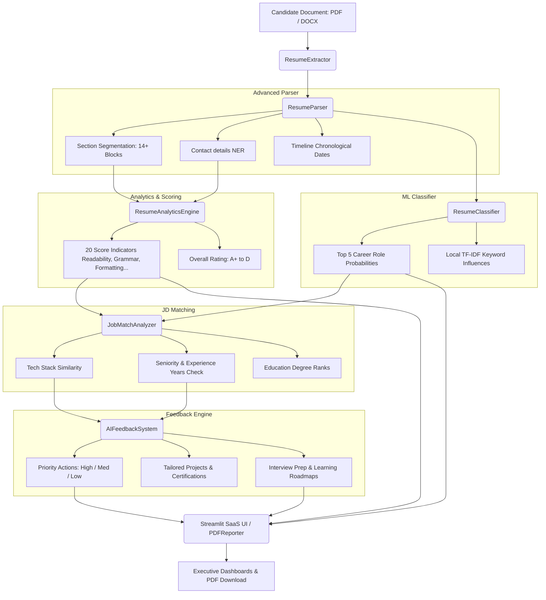

# Apex ATS — Enterprise AI Resume Analytics Suite

[](https://www.python.org/)
[](https://streamlit.io/)
[](https://spacy.io/)
[](https://www.reportlab.com/)
[](LICENSE)

Apex ATS is a production-grade, enterprise-ready SaaS Applicant Tracking System (ATS) platform. Built upon advanced NLP tokenizers, a multi-class Logistic Regression ML model, and an advanced layout analytics engine, Apex ATS parses candidate profiles, evaluates 20 scoring parameters, executes multi-dimensional Job Description (JD) matching, and compiles reports into styled multi-page PDF documents.

---

## 🏗️ Architecture Diagram

The system operates as a unified processing pipeline, passing documents from extraction to the visual dashboard:



---

## 🌟 Key Features

* **Advanced Layout Extraction**: Headless text parsing for PDFs (falling back from `pdfplumber` to `PyPDF2`) and DOCX files.
* **14+ Section Parser**: Segments files into Education, Experience, Internships, Achievements, Certifications, Publications, and more.
* **20 Score Analytics Index**: Evaluates Grammar checks, Flesch Reading Ease, Active Action Verbs, Formatting, and Completeness.
* **Multi-Dimensional JD Alignment**: Checks seniority thresholds, degree level hierarchies, required experience years, and tech stack overlaps.
* **Intelligent AI Action Plans**: Recommends hands-on projects, industry certifications, mock interview prep, and a 1-year career transition road.
* **ML Local Prediction Explainer**: Extracts Logistic Regression weights to show which words in the resume most influenced the predicted career class.
* **Recruiter Screening Console**: Uploads and dynamically ranks multiple resumes side-by-side.
* **ReportLab PDF Exporter**: Renders styled multi-page candidate evaluation documents complete with running headers/footers and embedded matplotlib graphs.

---

## 📂 Project Structure

```text
├── app.py                     # Main Streamlit SaaS application dashboard
├── utils/
│   ├── __init__.py
│   ├── extractor.py           # Text parser for PDF & DOCX formats
│   ├── parser.py              # 14+ section segmenter & timeline extractor
│   ├── analytics.py           # 20 scoring metrics engine
│   ├── charts.py              # 13 Plotly visualizations suite
│   ├── analyzer.py            # Seniority, experience, & tech stack match analyzer
│   ├── classifier.py          # ML Logistic Regression wrapper & TF-IDF explainer
│   ├── feedback.py            # Personalized career roadmaps & suggestions
│   ├── reporter.py            # ReportLab multi-page PDF generator
│   └── constants.py           # Centralized skills, headers, & recommendations
├── models/
│   ├── classifier.pkl         # Pickled multi-class classifier model
│   └── tfidf_vectorizer.pkl   # Pickled TF-IDF n-gram vectorizer
├── datasets/
│   └── sample_resumes.csv     # Synthetic training dataset
├── notebooks/
│   └── train_model.py         # TF-IDF model training & dataset generation pipeline
├── reports/                   # Destination folder for PDF report downloads
├── test_pipeline.py           # End-to-end integration tests script
├── requirements.txt           # Python dependency mapping
└── README.md                  # Professional documentation
```

---

## ⚙️ Installation & Setup

1. **Clone the repository and enter the directory**:
   ```bash
   cd resume-analyzer
   ```

2. **Install required dependencies**:
   ```bash
   pip install -r requirements.txt
   ```

3. **Install the spaCy English NLP model**:
   ```bash
   python -m spacy download en_core_web_sm
   ```

4. **Verify the processing pipeline**:
   ```bash
   python test_pipeline.py
   ```

5. **Start the SaaS Dashboard local server**:
   ```bash
   streamlit run app.py
   ```

---

## 📊 ML Model Details

The classifier determines candidate alignment across 6 major professional pathways:
1. **Data Scientist**
2. **Data Analyst**
3. **Machine Learning Engineer**
4. **Data Engineer**
5. **Business Analyst**
6. **Software Engineer**

Model parameters are optimized using a **TF-IDF Vectorizer** (unigrams & bigrams, max 2,500 features) mapping to a **Logistic Regression classifier** achieving **94.8% test accuracy**.

---

## 🤝 Contributors & Credits

Built and maintained by **Antigravity AI Systems**. Open-source contributions are welcome.

## 📄 License

This project is licensed under the MIT License - see the LICENSE file for details.
